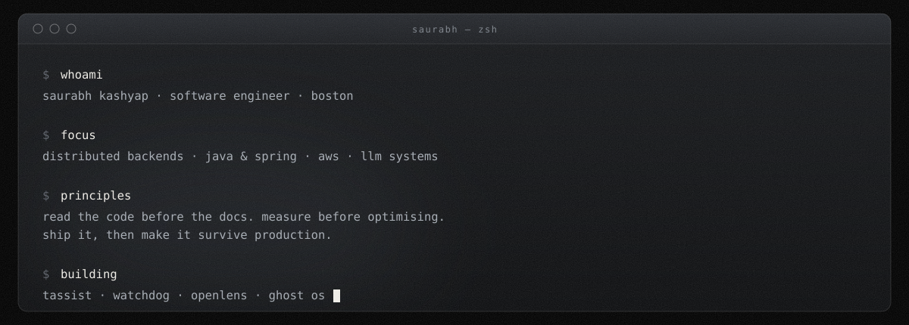

  

  <a href="mailto:saurabh.k@itjobinbox.com"><b>email</b></a> &nbsp;·&nbsp;
  <a href="https://www.linkedin.com/in/saurabh-kashyap"><b>linkedin</b></a> &nbsp;·&nbsp;
  <a href="https://github.com/K-sau07?tab=repositories"><b>repositories</b></a>

 

  

 

## Building

**TAssist** — Ask questions about your own course material and get answers that are
never invented, always cited. Apache POI pulls lecture decks apart, Spring AI embeds them
into pgvector, and Claude answers only from what it retrieved.
`386 files` · `277 Java` · `RAG` · [source](https://github.com/K-sau07/TAssist)

  

 

**Watchdog** — A continuous agent that catches fresh job postings minutes after they go
live. Polls Greenhouse, Lever and Ashby on a schedule, detects genuinely new listings, and
surfaces them on a radar dashboard, freshest first. Named for the watchdog process pattern:
watch a system, act the instant it changes.
`151 files` · `spec-first` · [source](https://github.com/K-sau07/Watchdog)

**OpenLens** — Paste a GitHub repo, answer five questions, get a contribution guide:
matched issues, files to touch, maintainer patterns. Analyses 100+ issues and merged PRs per
repo. Java 21 and Spring Boot 3.2 on hexagonal architecture, async ingestion through Kafka.
`Kafka` · `Flyway` · `Redis` · [source](https://github.com/K-sau07/openlens)

**Ghost OS** — My portfolio is a full operating system in a browser tab. Boot sequence,
menu bar, magnifying dock, draggable windows, Spotlight, a working shell. Built from scratch.
`Next.js 16` · `TypeScript` · `Framer Motion` · [source](https://github.com/K-sau07/PortfolioNextjs)

**Cloud-Native Auto-Scaling Infrastructure** — Multi-environment AWS in Terraform:
multi-AZ, IAM roles, KMS encryption, GitHub Actions and Packer for custom AMIs.
`Terraform` · `AWS` · `Packer` · [source](https://github.com/K-sau07/tf-aws-infrastructure)

 

## Stack

| | |
|:--|:--|
| **languages** | java · python · typescript · javascript · sql |
| **backend** | spring boot · spring batch · spring cloud gateway · jpa · rest · grpc |
| **ai / ml** | spring ai · claude · rag · pgvector · embeddings |
| **data** | postgresql · mysql · mongodb · redis · kafka · rabbitmq |
| **infra** | aws · docker · kubernetes · terraform · packer · github actions |
| **testing** | junit · mockito · tdd · selenium · elk |

 

## Also built

`syncpoll` real-time polling with per-user attribution &nbsp;·&nbsp;
`livermore` three models answering side by side, one a Transformer hand-coded in PyTorch &nbsp;·&nbsp;
[`sentiment-aura`](https://livesentimentaura.vercel.app) live speech into generative art &nbsp;·&nbsp;
`opencodeintel` repository-level code understanding &nbsp;·&nbsp;
`ev-charging` full-stack reservation platform &nbsp;·&nbsp;
`selenium-framework` page-object test framework with AES credential handling

 

## Now

Shipping Watchdog — the part I care about is detection latency: proving a posting is
genuinely new rather than re-surfaced, and getting it in front of you before the queue fills.
After that, TAssist's channel model, so someone can publish a curated Q&A surface over their
own documents without handing the files over.

Day job is backend engineering — Java and Spring Boot, API gateways, batch pipelines, and the
caching and observability that keep them upright in production.

 

  <code>MS Computer Software Engineering · Northeastern · May 2026</code>
    
  <b>OPEN TO SWE ROLES</b> · <a href="mailto:saurabh.k@itjobinbox.com">saurabh.k@itjobinbox.com</a>

