<div align="center">
  
</div>

<div align="center">
  <a href="mailto:saurabh.k@itjobinbox.com"></a>
  <a href="https://www.linkedin.com/in/saurabh-kashyap"></a>
  <a href="https://github.com/K-sau07?tab=repositories"></a>
</div>

<br>

```
saurabh@ghost ~ % whoami

Software Engineer · 3+ years · Boston, MA

I build distributed backend systems in Java and Spring Boot — enterprise API
gateways, batch processing platforms, and a regulated fintech order-execution
platform. Strong foundation in AWS, microservices, and performance work, with
hands-on LLM and RAG product experience.

saurabh@ghost ~ % _
```

<br>

## ` 01 ` &nbsp;Production systems

> Not side projects — these run in front of real users.

| System | Scale | What moved |
|:--|:--|:--|
| **Enterprise API Gateway** <br> <sub>Spring Cloud Gateway · Redis · MySQL</sub> | `3.2M` req/day <br> `99.95%` uptime | 45+ downstream endpoints consolidated behind one entry point. Client-side latency **−38%**. |
| **Nightly Data Sync** <br> <sub>Spring Batch · AWS S3 · MySQL</sub> | `1.2M+` records/night | Parallel chunk processing + skip-error handling. Batch completion **−61%**. |
| **Caching Layer** <br> <sub>Redis · cache-aside · TTL tuning</sub> | `62% → 89%` hit ratio | Database load **−44%** across reporting dashboards. |
| **Production Observability** <br> <sub>Elasticsearch · Logstash · Kibana</sub> | `8` microservices | Mean time to detect anomalies **14 min → under 4**. |
| **Fintech Order Execution** <br> <sub>Java · Spring Boot · OpenSearch</sub> | `6,000` orders/day | 5 order types, end-to-end validation and reconciliation. API latency **650ms → 180ms**. |

<br>

## ` 02 ` &nbsp;Selected work

<table>
<tr>
<td width="50%" valign="top">

### [TAssist](https://github.com/K-sau07/TAssist)
**AI course doubt resolution** · `386 files`

RAG-grounded answers streamed in real time with slide-level citations. Apache POI extracts decks into PostgreSQL + pgvector via Spring AI and Claude.

`Java` `Spring AI` `Claude` `pgvector` `React`

</td>
<td width="50%" valign="top">

### [Watchdog](https://github.com/K-sau07/Watchdog)
**Job posting agent** · `151 files`

Polls Greenhouse, Lever and Ashby on a schedule and surfaces brand-new postings minutes after they go live, freshest first.

`Java` `Spring Boot` `TypeScript` `React`

</td>
</tr>
<tr>
<td width="50%" valign="top">

### [OpenLens](https://github.com/K-sau07/openlens)
**OSS contribution guide generator**

Analyses 100+ issues and merged PRs per repo to cut contributor onboarding from an hour to under ten minutes. Hexagonal architecture, async Kafka ingestion.

`Java 21` `Spring Boot 3.2` `Kafka` `Flyway` `Redis`

</td>
<td width="50%" valign="top">

### [Cloud Infrastructure](https://github.com/K-sau07/tf-aws-infrastructure)
**Multi-AZ IaC on AWS**

Fault-tolerant multi-AZ deployments with IAM roles and KMS encryption. GitHub Actions + Packer AMIs cut deployment cycles ~65%.

`Terraform` `AWS` `Packer` `GitHub Actions`

</td>
</tr>
</table>

<br>

## ` 03 ` &nbsp;Stack

```
Languages     Java · Python · SQL · JavaScript · TypeScript
Backend       Spring Boot · Spring Batch · Spring Cloud Gateway · Spring Data JPA
              REST · gRPC · Spring AI
Architecture  Microservices · Distributed Systems · Event-Driven · Fault-Tolerant
Cloud         AWS (EC2 · S3 · RDS · Lambda · CloudWatch · OpenSearch)
              Docker · Kubernetes · Terraform · Jenkins · CI/CD
Data          PostgreSQL · MySQL · MongoDB · Redis · pgvector · Kafka · RabbitMQ
Testing       JUnit · Mockito · TDD · GitHub Actions · Packer · ELK
AI            LLM Integration · RAG · Anthropic Claude
```

**Certified** — AWS Solutions Architect · Spring Professional · Claude Certified Architect

<br>

## ` 04 ` &nbsp;Activity

<div align="center">
  
  
</div>

<br>

<div align="center">
  <sub><code>MS Computer Software Engineering · Northeastern University · May 2026</code></sub>
  <br><br>
  <sub>
    <b>OPEN TO SWE ROLES</b> &nbsp;·&nbsp;
    <a href="mailto:saurabh.k@itjobinbox.com">saurabh.k@itjobinbox.com</a>
  </sub>
</div>
