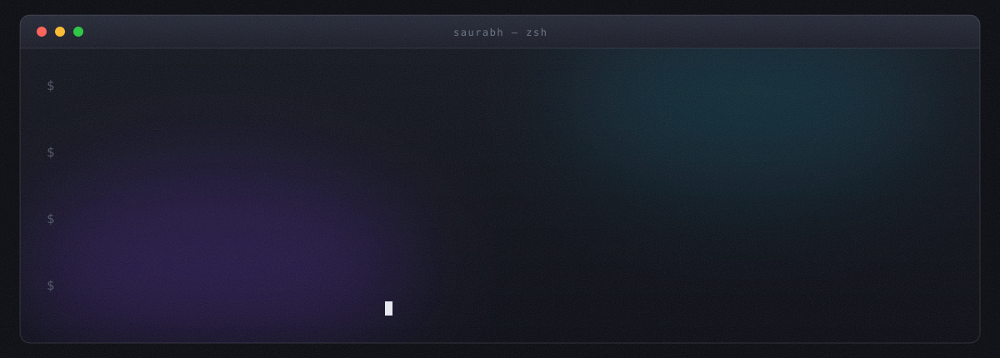
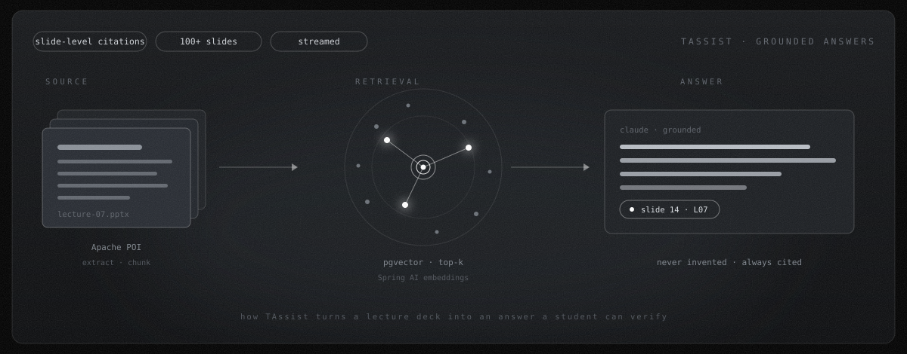

  

  
  
  

  

 

## 🛠 &nbsp;Stack

      

     

     

 

## 🚀 &nbsp;Building

### 🟣 &nbsp;TAssist &nbsp;·&nbsp; grounded answers over your own documents

Ask questions about your course material and get answers that are **never invented, always
cited**. Apache POI pulls lecture decks apart, Spring AI embeds them into pgvector, and Claude
answers only from what it actually retrieved.

     &nbsp;`386 files` &nbsp;[**source →**](https://github.com/K-sau07/TAssist)

  

 

### 🟡 &nbsp;Watchdog &nbsp;·&nbsp; catches job postings minutes after they go live

Polls Greenhouse, Lever and Ashby on a schedule, detects genuinely **new** listings the moment
they appear, and surfaces them on a radar dashboard — freshest first. Named for the watchdog
process pattern: watch a system, act the instant it changes.

    &nbsp;`151 files` &nbsp;[**source →**](https://github.com/K-sau07/Watchdog)

### 🔵 &nbsp;OpenLens &nbsp;·&nbsp; your first open-source PR, mapped out

Paste a GitHub repo, answer five questions, get a contribution guide: matched issues, files to
touch, maintainer patterns. Analyses **100+ issues and merged PRs** per repo and cuts
onboarding from an hour to under ten minutes. Hexagonal architecture, async Kafka ingestion.

    &nbsp;[**source →**](https://github.com/K-sau07/openlens)

### 🟢 &nbsp;Ecoplate &nbsp;·&nbsp; food waste, priced dynamically

Connects grocery stores with customers and NGOs to cut food waste — surplus stock gets
dynamically discounted before expiry, and what doesn't sell routes to NGOs for free
distribution. Team project, Java/Spring backend with JaCoCo coverage in CI.

    &nbsp;`80 Java files` &nbsp;[**source →**](https://github.com/CanNortheastern/CSYE7230Group1)

### ⚡ &nbsp;EV Charging System &nbsp;·&nbsp; reserve a charger before you drive there

Full-stack platform for EV owners and station operators. Email-OTP auth, live charging-session
timers, automated reservation management and integrated billing, over a normalised SQL Server
schema. Solves the actual problem: turning up to a charger that's already taken.

    &nbsp;[**source →**](https://github.com/K-sau07/EV_CHARGING_SYSTEM)

### 👻 &nbsp;Ghost OS &nbsp;·&nbsp; my portfolio is an operating system

Boot sequence, menu bar with working dropdowns, magnifying dock, draggable and resizable
windows, Spotlight, right-click menus, and a shell you can actually type into. Built from
scratch — no UI kit.

    &nbsp;[**source →**](https://github.com/K-sau07/PortfolioNextjs)

### 🟠 &nbsp;Cloud-Native Auto-Scaling Infrastructure

Multi-environment AWS in Terraform — multi-AZ, IAM roles, KMS encryption, with GitHub Actions
and Packer building custom AMIs end to end.

   &nbsp;[**source →**](https://github.com/K-sau07/tf-aws-infrastructure)

 

## 📦 &nbsp;Also built

| | | |
|:--|:--|:--|
| [**Sentiment Aura**](https://livesentimentaura.vercel.app) 🎨 | live speech → sentiment → generative art | `p5.js` `Deepgram` `Groq` |
| **Livermore** 📈 | three models side by side — one a Transformer hand-coded in PyTorch | `Python` `RAG` `PyTorch` |
| **SyncPoll** 📊 | real-time polling where attendance is a by-product of answering | `Java` `WebSocket` |
| **OpenCodeIntel** 🔍 | repository-level code understanding | `Python` `TypeScript` |
| **Webapp + Infra** ☁️ | Java 21 service on a Terraform-provisioned AWS stack | `Spring Boot 3.2` `S3` |
| **Selenium Framework** 🧪 | page-object test framework, AES credential handling | `TestNG` `Maven` |
| **PackNGo** 🎒 | travel-logistics application | `Java` |
| **Scientific Calculator** 🧮 | iOS-inspired scientific calculator | `React` |

 

## 📊 &nbsp;Activity

  
  

 

## 💭 &nbsp;Now

Shipping **Watchdog** — the interesting part is detection latency: proving a posting is
genuinely new rather than re-surfaced, and getting it in front of you before the queue fills.
Next up is TAssist's channel model, so you can publish a curated Q&A surface over your own
documents without handing the files over.

Day job is backend engineering — Java and Spring Boot, API gateways, batch pipelines, and the
caching and observability that keep them upright in production.

 

  <code>MS Computer Software Engineering · Northeastern University · May 2026</code>
    
  

